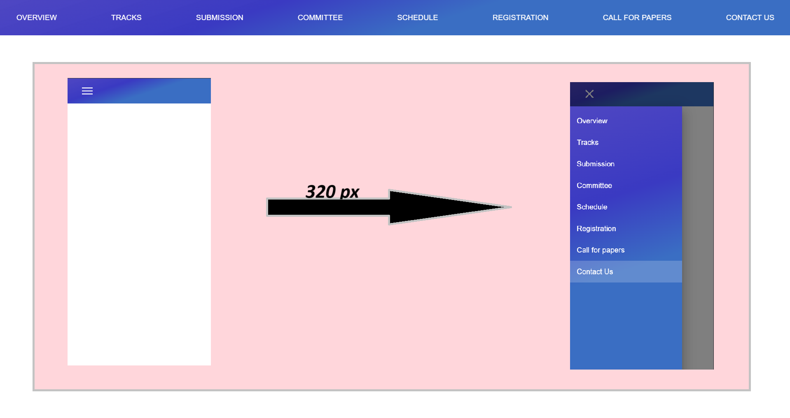

# Responsive Router Navbar with Material UI

This project provides a responsive router navbar built with Material UI. It is designed to be mobile-friendly and adapts to different screen sizes.



## Features

- Responsive design: The navbar adapts to different screen sizes, providing an optimal user experience on both desktop and mobile devices.
- Routing: Integrated with React Router for seamless navigation.
- Material UI: Built with Material UI for a modern, clean aesthetic.

## Installation

1. Clone the repository:

```bash
git clone https://github.com/c4dr-me/responsive-react-navbar-with-mui.git
```

2. Install the dependencies:

```bash
npm install
```

3. Start the development server:

```bash
npm run dev
```

Visit `http://localhost:5173` in your browser to view the app.

## Usage

Click on the different links in the navbar to navigate between pages. On smaller screens, the navbar collapses into a hamburger menu for easier navigation with drawer/sidebar.

## Contributing

Pull requests are welcome. For major changes, please open an issue first to discuss what you would like to change.

## License

[License](LICENSE)

# React + Vite

This template provides a minimal setup to get React working in Vite with HMR and some ESLint rules.

Currently, two official plugins are available:

- [@vitejs/plugin-react](https://github.com/vitejs/vite-plugin-react/blob/main/packages/plugin-react/README.md) uses [Babel](https://babeljs.io/) for Fast Refresh
- [@vitejs/plugin-react-swc](https://github.com/vitejs/vite-plugin-react-swc) uses [SWC](https://swc.rs/) for Fast Refresh
